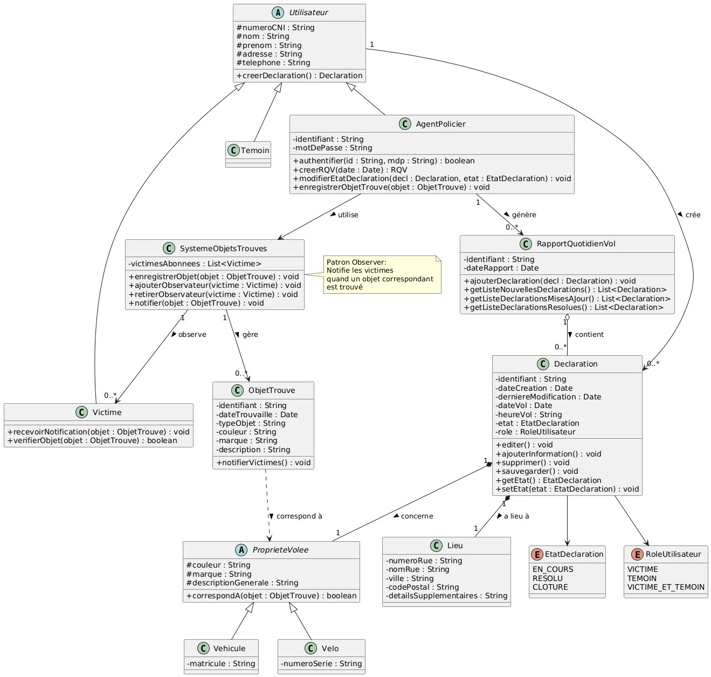

# Rapports-Quotidiens-De-Vol

## 1. Diagramme des cas d'utilisation et des scénarios importants

## 2. Diagrammes de séquences décrivant ces scénarios et début d’identification des principaux paquetages de votre projet.
### Déclaration de Vol

### RQV et Système d'Objets Trouvés

## 3. Diagramme de classes.

## 4. Diagrammes de collaboration.
### Diagramme de Collaboration : Pattern Observer (Objet Retrouvé)
.png)
### Diagramme de Collaboration : Gestion RQV (Sauvegarde Déclaration)
.png)
## 5. Diagrammes états-transitions et d'activités pour "fixer" les idées (ex : états d'une valeur d'une déclaration).
### Diagramme d'États-Transitions - Déclaration de Vol

### Diagramme d'États-Transitions - Rapport Quotidien de Vol

 ### Diagramme d'États-Transitions - Objet Trouvé

### Diagramme d'États-Transitions - Agent Policier (Session)
.png)
### Diagramme d'États-Transitions - Utilisateur Public (Victime/Témoin)
.png)
### Diagramme d'États-Transitions - Notification Victime

